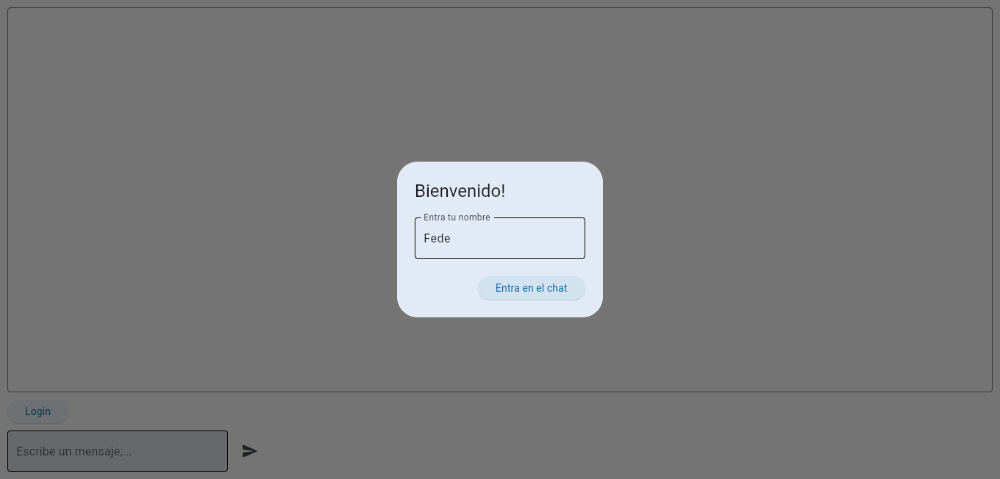
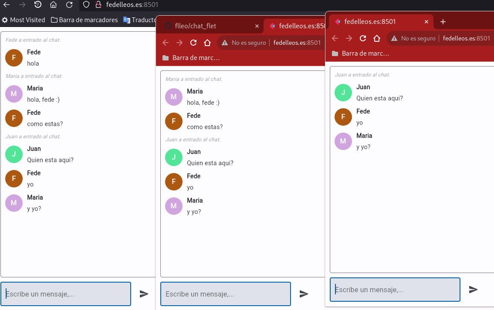

# chat_flet

## Requirements.txt and virtualenv

### Create "requeriments.txt" with a list of application dependencies. At minimum it should contain flet module:

flet>=0.2.4

### Create a virtualenv and install requirements:
<pre>
python -m venv .venv
source .venv/bin/activate
pip install -r requirements.txt
</pre>

### Enable the Flet server

<pre>
cd /etc/systemd/system
sudo ln -s /home/ubuntu/char_flet/chat_flet.service
sudo systemctl start chat_flet
sudo systemctl enable chat_flet
sudo systemctl status chat_flet
</pre>

### Para cualquier cambio en el codigo

<pre>
  python -m venv .venv
  sudo systemctl restart chat_flet
</pre>

## 

## 

